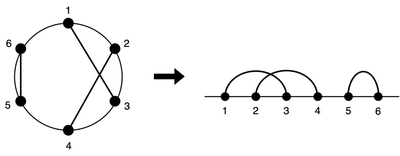

### 공식 에디토리얼

**문제 링크**  
<https://atcoder.jp/contests/abc338/tasks/abc338_e>

**원문 링크**  
<https://atcoder.jp/contests/abc338/editorial/9172>

일반성을 잃지 않도록 \\(A_i < B_i\\)라 가정합시다.

먼저, 다음의 그림과 같이 원형의 고리를 점 \\(1, 2N\\)의 사이에서 펼쳐 직선으로 두고 생각합니다. 원래 현이었던 부분은 원래 고리였던 직선상의 곡선으로 나타내집니다.

여기서, 원래 고리에서 현끼리의 교점이 존재하는 것과, 위의 오른쪽 그림처럼 펼친 상태에서 곡선끼리의 교점이 존재하는 것은 동치입니다.(증명 생략)  
따라서, 펼진 상태에서 생각하는 것으로 문제를 쉽게 생각할 수 있습니다. 현끼리의 교점을 생각하는 문제에 있어서는 이렇게 펼치는 아이디어가 자주 출제됩니다.

그럼 펼친 상태에서의 곡선끼리의 교점이 존재하는가를 판정하는 것에 대해 생각해봅시다.  
먼저, 곡선끼리의 교점이 **존재하지 않는다**는 것은, \\(A_i < A_j < B_i < B_j\\)를 만족하는 \\(i, j (i \neq j)\\)가 **존재하지 않는다** 는 것(*)과 동치입니다. 이를 BBST나 세그먼트 트리를 이용해 \\(O(N \log N)\\)에 판정할 수 있지만, 여기선 스택을 이용해 \\(O(N)\\)에 판정하는 알고리즘을 소개합니다.

1. 빈 스택 \\(S\\)를 준비한다.
2. \\(j = 1, 2, ..., 2N\\)의 순서로 다음을 실행한다.
    - 점 \\(j\\)가 어떤 곡선의 왼쪽 끝, 즉 어떤 \\(i\\)에 대해 \\(A_i = j\\)라면, \\(S\\)의 끝에 \\(i\\)를 하나 추가한다.
    - 점 \\(j\\)가 어떤 곡선의 오른쪽 끝, 즉 어떤 \\(i\\)에 대해 \\(B_i = j\\)라면, \\(S\\)의 끝에서 하나의 원소를 꺼낸다. 꺼낸 원소가 \\(i\\)가 아니라면, 교점이 존재하는 것을 보고하고 프로그램을 종료한다.
3. 마지막까지 프로그램이 종료되지 않았다면, 교점이 존재하지 않는다는 것을 보고한다.

이 알고리즘의 정확성에 대한 증명은 생략합니다. 직관적으로 이해하기 힘든 경우 앞서 서술한 조건 (*)를 [점\\(1\\)부터 점\\(2N\\) 방향으로 왼쪽에서 오른쪽으로 보아갈 때, 곡선\\(i\\)의 왼쪽 끝이 오고, 그 오른쪽 끝에 다다르기 전에 곡선 \\(j\\)의 왼쪽 끝에 도달한다면, 곡선 \\(j\\)의 오른쪽 끝은 곡선 \\(i\\)의 오른쪽 끝보다 먼저 오지 않으면 안 된다]고 생각하면, 아직 왼쪽 끝이 오지 않은 곡선을 후입선출의 자료구조로 관리하는 아이디어가 자연스레 떠오를 것입니다.

### D에서 너무 많은 시간을 썼다.

D에서 너무 많은 고민을 하고 시간을 다 날려먹은 나머지 E는 그림 대충 보고 패스.  
지금 생각하면 풀 수 있었을지도 모르는 문제였다 싶다.

진짜 E까지 푸는 길은 멀고도 험하다.